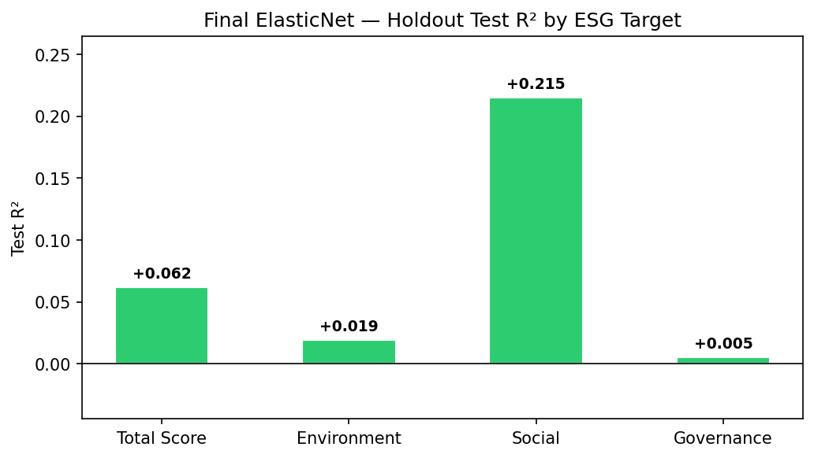
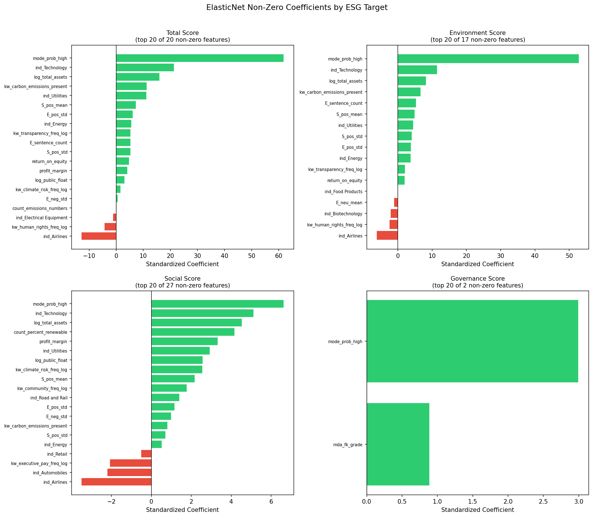

# Democratizing ESG: Predicting Corporate Sustainability Scores from Free Public Data

## Team

Caden Lippie, Ethan Radecki, John Masseria

## Introduction

Commercial ESG (Environmental, Social, and Governance) ratings from agencies like MSCI and Sustainalytics cost $5,000 to over $30,000 per year and cover roughly 10,000 companies worldwide. The methodologies behind these ratings are proprietary, which means that neither the investors paying for the data nor the companies being rated understand how their scores are calculated, this creates two problems. First, retail investors who want to align their portfolios with personal values are priced out of the data entirely, and second, most public companies remain unrated and invisible to the growing pool of ESG-focused capital. The global ESG asset market exceeds $30 trillion, and yet the majority of market participants lack access to the information needed to participate in it.

Our project addresses this gap by building a machine learning pipeline that predicts corporate ESG scores using only freely available public data. In the United States, all public companies must file annual 10-K filings with the Securities and Exchange Commission (SEC). These filings contain comprehensive business information including risk disclosures, management discussion, and financial statements. For this project, we chose to extract text from three key sections of these 10-K filings, generate financial sentiment and keyword features using FinBERT (a finance-specific language model), and supplement these with structured financial fundamentals pulled from the SEC EDGAR XBRL API. The combined feature set feeds into an ElasticNet regression model, with standardized coefficients providing direct, interpretable feature-level explanations for every prediction. The pipeline solely uses freely available public data, which means there's no proprietary feeds, no prior ESG ratings, and no cost barrier.

This project is a proof of concept rather than a production-ready system. Our best single-target result is a Social pillar R² of 0.215, and our models cannot predict Governance scores at all from the 10-K text and financial fundamentals alone, which is a finding that we frame as a structural ceiling confirming that governance scores require external data sources that do not appear in annual 10-K filings. These results are modest compared to prior research, but those studies typically relied on financial ratios or prior ESG scores as model features, which are either expensive or self-reinforcement mechanisms for the scores being predicted. Instead of providing a production-ready solution, our contribution is methodological, since we are able to demonstrate that free publicly available data can extract interpretable ESG signals and a transparent machine learning pipeline can partially replicate what commercial providers charge thousands of dollars a year for. For our primary stakeholders, which are retail investors, this establishes a foundation that future work could extend with additional data sources to improve predictive performance while maintaining the transparency and accessibility that commercial ratings lack.

## Literature Review

Environmental, social, and governance (ESG) ratings are quantitative assessments that professional agencies assign to companies based on their performance in environmental, social, and governance fields. The major agencies that assign these scores include MSCI, Sustainalytics, Refinitiv, and S&P Global. These agencies use proprietary methodologies to analyze publicly available data, such as annual company reports and sustainability disclosures[^1][^2]. Each agency evaluates a company's exposure to material ESG risks that are relevant to their industry, and then assesses the quality of the management systems the company has in place to address those risks. For example, MSCI covers over 10,000 companies across the globe and assigns relative ratings from AAA to CCC based on weighted assessments across 35 key ESG issues[^1]. Access to these ratings requires subscriptions that can range from $5,000 to over $30,000 annually, with higher level services demanding even higher fees[^3]. Despite their widespread adoption by asset managers and institutional investors, the specific calculations, weightings, and transformations that determine these ratings remain proprietary.

Despite ESG ratings widespread use in financial markets, the ratings themselves face significant limitations related to accessibility and reliability. A 2021 study completed by the CFA Institute found that correlations between major ESG ratings providers fall below 50%, suggesting that the same company can receive significantly different ratings depending on the evaluating agency[^4]. In contrast, credit ratings, another common practice in the financial industry, consist of correlations between agencies of over 94%. Aside from the major inconsistency, the proprietary nature of these methodologies creates a "black box" issue, where neither companies nor investors understand how these scores are calculated. Allianz Global Investors, a major asset manager, acknowledged these concerns as a critical limitation and developed its own ESG rating system to provide explainability and accountability[^5]. Additionally, the cost barriers create even more access problems. Subscriptions priced in the thousands of dollars per year effectively exclude retail investors from accessing ESG data, while the limited coverage means the vast majority of public companies remain unrated and invisible to ESG-focused investors.

Recent research shows that ML models can effectively predict ESG scores using various data sources. Multiple studies have shown that models incorporating financial data and textual analysis achieve accuracy scores of over 80%[^6][^7]. For example, a 2024 study using BERT-based NLP models achieved an ESG classification accuracy of 80.79%[^6], while another study reported an R² of 0.979 using stacked ensemble ML approaches[^7]. A key technology for this work has been FinBERT, a finance-specific language model that significantly outperforms general-purpose NLP models for financial text analysis tasks[^8]. FinBERT has been applied successfully to financial sentiment analysis and ESG classification tasks, emphasizing the viability of using NLP techniques to extract meaningful insights from corporate disclosures.

However, most existing research relies on either financial ratios or prior ESG ratings as primary predictors. The high performance figures from those studies reflect the strength of those features and signals they provide. Financial ratios capture company fundamentals that correlate with ESG investments and prior ESG ratings are somewhat of a self-reinforcement mechanism for the scores that are being predicted. There has been limited exploration of predicting ESG scores directly from raw text of regulatory filings without these additional features.

Our approach builds on the foundations laid above but departs from prior work in two different ways. First, for this project we made it a necessity that only freely available data was used, which led us to both the SEC 10-K filings and the EDGAR financial fundamentals, instead of proprietary data or prior ESG scores. These choices deliberately remove the cost barrier entirely and avoid the self-reinforcement issue with utilizing prior ESG scores for model predictions. Second, we paired FinBERT text features with ElasticNet regression rather than the ensemble methods common in prior studies. This decision was driven by a finding during model selection, which is that when you have 323 companies and 130 features the dataset will exhibit sparse signals with most features so many will carry little weight within the training process but still be included to make predictions. ElasticNet was the right choice to handle these sparse signals since its L1 regularization drives irrelevant features to exactly zero, which produced more stable cross-validated performance than XGBoost across all four ESG targets. The ElasticNet coefficients themselves are intuitive and useful for drawing actionable decisions from the model, providing stakeholders with direct insight into which disclosure patterns and financial characteristics drive the predictions, educating their investment strategies. Unlike tree-based ensemble methods such as XGBoost, ElasticNet does not require post-hoc explainability tools like SHAP; the standardized coefficients directly quantify each feature's contribution to the prediction, making the model inherently transparent.

Our primary stakeholders are retail investors, which are individual investors that manage their own portfolios and who increasingly want to align their investment strategies with personal values but cannot afford institutional ESG data subscriptions. A secondary stakeholder group consists of small and mid-cap public companies that currently lack ESG scores and need insight into how they perform relative to industry peers. By providing free, explainable ESG score predictions derived from solely publicly available data, this work addresses the accessibility and transparency gaps that existing commercial scores leave open.

## Data and Methods

### Data

#### ESG Ratings

Our target labels come from a Kaggle ESG ratings dataset aggregating scores from a major commercial rating provider for companies in the S&P 500 and adjacent indices as of 2022. The dataset contains 709 companies with four score dimensions:

- **Total score** (0–3000): composite ESG rating
- **Environment score** (0–1000): emissions, climate risk, natural resources
- **Social score** (0–1000): labor practices, human rights, community relations
- **Governance score** (0–1000): board structure, executive compensation, shareholder rights

Score distributions show a characteristic bimodal structure in the environment pillar, with a cluster boundary near 500, which is a pattern documented in prior literature as a disclosure threshold artifact where companies crossing minimum reporting standards receive systematically higher scores. This theory was attempted to be tested using different sources of data. One of those tests was to examine EU ESG scores due to the mandandated reporting across all companies. Additionally pre-2020 scores where given the benift of the doubt on non-reported metrics which was changed in April 2020 to assign non-reported metrics with zero's instead. Both of these data sources were attempted to be investigated, however data was unaccesible.

*Figure 1: **Environment Score** is bimodal with two distinct peaks around 200 to 220 and 500 to 520, suggesting two clusters of companies: low and high environmental performers with few in the middle. **Social Score** is more right-skewed with a sharp peak around 300, while also maintaining some bimodality. **Governance Score** is the most normally distributed of the three pillars, with a tight cluster around 280 to 310 and a mean of 278.8, with slight bimodality persisting. **Total Score** is also bimodal with peaks around 1050 to 1100. The bimodality remains withing industries and cannot be fully explained by data we were able to find.* 

The dataset covers 11 GICS industry sectors with significant imbalance, Industrials and Financials together represent over 35% of the sample.

*The Kaggle dataset is not included in this repository due to size constraints. It can be accessed at [https://www.kaggle.com/datasets/tonylm00/business-companies-dataset?select=raw.csv.](https://www.kaggle.com/datasets/alistairking/public-company-esg-ratings-dataset)*

#### SEC 10-K Filings

Annual 10-K filing text was retrieved via the SEC EDGAR API (`sec-edgar-downloader` Python library) for FY2021 filings, timed to precede the 2022 ESG ratings. Three narrative sections were extracted per filing:

- **Item 1 — Business**: company operations, products, and markets (~67,600 characters average)
- **Item 1A — Risk Factors**: material risks facing the company (~123,100 characters average)
- **Item 7 — MD&A**: management discussion of financial results (~96,000 characters average)

Of 709 ESG-rated companies, 332 had complete 3-section extractions. A quality audit (`work/10-K_filings_extraction_quality_check.ipynb`) identified 9 critical bad-extraction companies (XBRL financial tag contamination or table-of-contents stubs extracted in place of prose) and removed them, yielding **323 companies** for modeling.

#### SEC Financial Fundamentals

FY2021 balance-sheet and income-statement data was retrieved via the SEC EDGAR Company Facts XBRL API for all 323 companies. Five log-transformed features were retained after a multicollinearity reduction pass: total assets, public float, net income, operating income, and debt-to-assets ratio. Industry-median imputation was applied for the 14 companies missing specific line items.

---

### Methods

#### Feature Engineering Pipeline

The final model used approximately 130 features across eight groups:

**FinBERT Sentiment Features** (76 features): Each 10-K section was chunked into sentences, up to 300 per pillar (raised from an initial cap of 100 after an EDA finding that 68–79% of Social and Governance sentences were hitting the cap). FinBERT scored each sentence as positive, negative, or neutral. Per-section aggregates retained: mean positive/negative/neutral probability, positive-to-negative ratio (clipped at the 99th percentile), net sentiment score, and sentence count. This yields 18 features per section × 3 sections plus 6 document-level aggregates. Zero-variance features were dropped.

**Keyword Frequency Features** (14 features): Term frequency of predefined ESG keyword groups (emissions, governance, social, sustainability, etc.) per section, log-transformed (log(1 + x)) to compress the heavy-tailed distribution.

**SEC Financial Fundamentals** (5 features): Log-transformed scale features capturing company size, a known correlate of ESG rating magnitude.

**Document Structure Features** (4 features): Section-level document length indicators from the extracted JSON.

**Extended Structural Features** (21 features): Per-section Flesch-Kincaid readability grade (via `textstat`), quantitative density (numeric token mentions per 1,000 words), uncapped sentence count, average sentence length, and section-length bucket flags. Derived cross-section features include total word count, mean FK grade, and an MD&A quantitative density flag. Top correlations with total score: business sentence count (r = 0.20), business word count (r = 0.17), mean FK grade (r = 0.14).

**Mode Probability Feature** (1 feature, `mode_prob_high`): A depth-3 DecisionTree classifier was trained on the training split to predict whether a company falls in the "high environment" mode (score ≥ 500), reflecting the bimodal threshold structure. Rather than hard mode assignment (which degraded performance — see Results), the classifier's continuous probability output was used as a soft feature. The classifier was fit on training data only, before the train/test split to prevent label leakage.

**Industry One-Hot Encoding** (38 features): GICS sector and subsector dummies encoding industry membership, capturing large between-industry variance in ESG scores that text features alone cannot recover.

#### Approaches Evaluated but Not Used in Final Model

**TF-IDF / LSA Semantic Features**: A TF-IDF (2,000 features, bigrams, sublinear_tf) → TruncatedSVD (50 components) pipeline was built and evaluated as a non-FinBERT semantic complement (`work/tfidf_lsa_features.ipynb`). Adding 50 LSA components caused a regularization cascade: ElasticNet raised alpha to compensate for the additional noisy dimensions, suppressing genuine signal features. Environment test R² fell from +0.019 to −0.227 when LSA was included. LSA features were excluded from the final model. Finding: document topic patterns from 10-K vocabulary do not improve ESG score prediction beyond FinBERT sentiment at this dataset scale.

**Hard Mode-Split Modeling**: A two-stage pipeline was evaluated (`work/mode_split_modeling.ipynb`): classify each company into a high/low environment mode with a depth-3 DecisionTree, then fit separate ElasticNetCV models per mode. Oracle results using true mode labels showed genuine within-mode signal (environment R² = +0.74, total R² = +0.60), confirming that the bimodal structure is real and learnable in principle. However, the mode classifier achieved only 61.5% accuracy on the test set, barely above the 52% class-balance baseline. Using predicted modes degraded all targets by −0.21 to −0.53 R² relative to the single-model baseline due to misassignment applying the wrong model to an entire segment of companies. Hard mode-split was not used; the `mode_prob_high` soft feature was adopted instead.

#### Model Selection

Four regression models were compared across all four ESG targets using a consistent 80/20 train/test split and 5-fold cross-validation (`work/Feature_Extraction_and_Modeling.ipynb`, `work/archive/model_comparison_and_grade_classifier.ipynb`):

| Model | Total CV R² | Notes |
|-------|-------------|-------|
| ElasticNetCV | +0.194 | Best across all targets; automatic alpha/l1_ratio selection |
| LassoCV | +0.186 | Similar to ElasticNet; slightly less stable on correlated industry features |
| XGBoost | +0.084 | Overfits on 323-company dataset; CV R² degrades with tuning |
| Ridge | −0.025 | Cannot perform feature selection; all features remain active |

ElasticNet was selected as the final model due to it's CV R² value and it's ability to deal with high dimensional data. ElasticNet also acts as a form of dimensionality reduction technique and mitigates multi-colinearity issues, because of its feature selection.

#### Training and Evaluation

The final model used `ElasticNetCV` (5-fold CV, 100 alpha values, 10 l1_ratio values, max_iter = 10,000) trained on the 80% training split (n = 256 companies). Features were scaled with `StandardScaler` fit on training data only, as ElasticNet is scale-sensitive. Final evaluation used the 20% holdout test set (n = 67 companies). 5-fold CV R² was computed as an additional reference, but it is upward-biased because alpha selection uses the same folds, test R² is the unbiased performance estimate.

---

### Supporting Files

All supporting Jupyter notebooks are in the `work/` directory. A full index with detailed descriptions is maintained in `work/README.md`. Summary below:

**Data Collection**

| Notebook | Purpose |
|----------|---------|
| `10-K_filings_data_pull.ipynb` | Downloads and extracts Business, Risk Factors, and MD&A sections from SEC EDGAR 10-K filings |
| `10-K_filings_extraction_quality_check.ipynb` | Audits extraction quality; flags 9 critical failures (XBRL contamination, TOC stubs) for removal |
| `structured_features_collection.ipynb` | Fetches FY2021 financial fundamentals from SEC EDGAR Company Facts XBRL API |

**Exploratory Data Analysis**

| Notebook | Purpose |
|----------|---------|
| `EDA_ESG.ipynb` | ESG score distributions, industry composition, pillar correlations, grade distributions |
| `EDA_10-K_filings.ipynb` | FinBERT feature validation, sentence cap floor-effect analysis, within-industry bimodality, UMAP/PCA visualization |
| `EDA_Structured_Features.ipynb` | Company size vs. ESG score analysis; bimodal threshold investigation |

**Feature Engineering and Modeling**

| Notebook | Purpose |
|----------|---------|
| `Feature_Extraction_and_Modeling.ipynb` | Main pipeline: FinBERT extraction (300-cap), feature engineering, four-model comparison, ablation experiments |
| `structural_features_extended.ipynb` | Extracts Flesch-Kincaid readability, quantitative density, and document-structure features |
| `archive/tfidf_lsa_features.ipynb` | TF-IDF → LSA semantic features (evaluated; excluded from final model) |
| `archive/mode_split_modeling.ipynb` | Oracle vs. predicted mode-split experiment; evaluates two-stage bimodal modeling |
| `archive/hyperparameter_tuning.ipynb` | XGBoost RandomizedSearchCV and RidgeCV alpha tuning |
| `archive/model_comparison_and_grade_classifier.ipynb` | Unified model comparison across targets; grade conversion; class-weighted grade classifier |
| `archive/shap_explainability_analysis.ipynb` | SHAP explainability for XGBoost across all four ESG targets |

**Final Model Evaluation**

| Notebook | Purpose |
|----------|---------|
| `final_model_validation.ipynb` | Final ElasticNet holdout evaluation: 323 companies, ~130 features, all four targets. Coefficient plots, feature group contribution chart, industry R² breakdown, grade confusion matrix |

---

## Results

### Holdout Test Performance

The table below reports results from the held-out 20% test set (n = 67 companies) and 5-fold CV on the training set. All four ESG targets show positive test R², a meaningful improvement over earlier model iterations in which governance and environment were effectively at zero.

| Target | CV R² | Test R² | MAE | RMSE | Alpha | L1 Ratio | Non-zero Features |
|--------|-------|---------|-----|------|-------|----------|-------------------|
| total_score | 0.247 | 0.062 | 145.91 | 172.82 | 16.63 | 0.99 | 20 |
| environment_score | 0.311 | 0.019 | 103.76 | 119.93 | 11.43 | 0.99 | 17 |
| social_score | **0.142** | **0.215** | 30.87 | 39.30 | 4.75 | 0.95 | 27 |
| governance_score | −0.008 | 0.006 | 36.43 | 42.81 | 6.41 | 0.99 | 2 |

 

*Figure 2: Final model Test R² and 5-fold CV R² across all four ESG targets. Social achieves the strongest holdout result (Test R² = 0.215).*

**Interpreting error in original units**: ESG total scores span roughly 200–900, with an interquartile range of approximately 300 points. A total-score RMSE of 172.82 represents roughly 40–60% of the typical score range, the model identifies direction and rough tier, but is not precise enough for investment-grade scoring. Social scores have a narrower IQR (~150 points); the social RMSE of 39.30 is a similar relative error, consistent with the stronger R².

The l1_ratio of 0.99 across nearly all targets means the signal is near lasso optimal and the model is behaving more like a Lasso regression model while retaining a small (1%) component of Ridge regularization. This means the model is more aggressive when selecting features and works well with this high-dimensional use case.

### Feature Importance

*Figure 3: Top 20 non-zero ElasticNet coefficients by ESG target (standardized). Green bars indicate features that increase predicted scores; red bars indicate features that decrease predicted scores. Feature counts after L1 selection: Total Score = 20, Environment = 17, Social = 27, Governance = 2.*

The L1 penalty drove 110–128 of the 130 input features to exactly zero, leaving a sparse, interpretable set of predictors per target. All four targets include `mode_prob_high` and company scale features, but the ESG-pillar-specific predictors differ substantially.

**Mode probability is the dominant predictor across all targets.** `mode_prob_high`, which is the soft probability that a company falls in the high-environment disclosure tier (environment score ≥ 500) from the depth-3 decision tree classifier, carries by far the largest standardized coefficient in every target of approximately 60 for Total Score, 50 for Environment, 6 for Social, and 2.5 for Governance. Its dominance reflects the bimodal score structure documented in Figure 1: once the model estimates which side of the disclosure threshold a company falls on, that single signal is more informative than any specific ESG keyword or sentiment feature. Its influence across all four pillars, not just Environment, indicates that a company's general disclosure orientation is encoded throughout its 10-K text and financial fundamentals.

**Company scale is the second consistent driver.** `log_total_assets`, which is the metric used to describe company size, carries a positive coefficient across Total Score, Environment, and Social targets. `log_public_float` also appears across Total Score and Social targets. Larger, more widely-held companies receive higher ESG scores. This could be a result of their greater capacity to invest in ESG programs, and the rating agencies' tendency to cover large-cap firms more thoroughly.

**Keyword presence and frequency confirm disclosure depth drives scores.** `kw_carbon_emissions_present`, which is a binary indicator of whether carbon emissions language appears anywhere in the 10-K, is a top-five predictor for both Total Score and Environment. `kw_transparency_freq_log`, `kw_climate_risk_freq_log`, `kw_renewable_energy_freq_log`, and `kw_human_rights_freq_log` all load positively across Total and Environment targets. These keyword features collectively say the same thing: companies that explicitly discuss emissions, climate risk, renewable energy, transparency, and human rights in their annual filings score higher. This is consistent with ESG rating methodology rewarding disclosure breadth, mentioning the topic signals engagement, not just performance outcomes.

**FinBERT sentiment features capture disclosure quality signals.** `S_pos_std`, the standard deviation of positive sentiment scores across Social-section sentences, appears positively in both Total Score and Environment targets. Higher variance in positive sentiment indicates that companies include sentences with very strong positive language (peaks of enthusiasm about community programs, workforce initiatives), which the rating agency appears to reward. `E_sentence_count` loads positively on Total and Environment targets: longer Environmental section disclosures correlate with higher scores, reflecting that disclosure volume is itself a quality signal. `E_neg_std` and `E_neu_mean` appear in smaller roles, capturing the linguistic texture of environmental disclosures beyond simple sentiment averages.

**Industry membership encodes between-sector ESG norms.** `ind_Airlines` carries the largest negative coefficient in Total Score (approximately −10), reflecting the aviation sector's high emissions exposure and lower environmental scores. `ind_Technology` appears as a positive predictor for Total, Environment, and Social, consistent with tech companies' lighter physical footprint relative to industrials. For Social Score, `ind_Airlines`, `ind_Automobiles`, `ind_Technology`, and `kw_executive_pay_freq_log` are the main negative predictors. The negative executive pay keyword coefficient (~−3.4 for Social) is notable: companies that discuss executive compensation more frequently in their 10-K tend to score lower on Social metrics, suggesting that companies facing compensation controversy write more defensively about pay, and the same underlying issues that generate that defensive language also produce lower Social scores.

**Profitability features appear primarily in Social.** `profit_margin` and `return_on_equity` load positively for Social and Total Score targets, but carry small coefficients. More profitable companies may have greater capacity to invest in social programs, or strong financial management and strong social management may co-occur. `count_percent_renewable` and `ind_Electrical Equipment`, `ind_Utilities`, `ind_Road and Rail` are among the positive Social predictors, reflecting industries with more mature workforce and community relations disclosures.

**Governance reveals a structural ceiling.** With only 2 non-zero features and a test R² near zero, Governance is effectively unpredictable from this feature set. The two features ElasticNet retained are `mode_prob_high` (the bimodal probability, again dominant at ~2.5) and `mda_fk_grade` (the Flesch-Kincaid readability grade of the MD&A section, coefficient ~0.5). Neither is a governance-specific signal. The model is essentially saying the best it can do for Governance is to use general disclosure tier and document complexity as proxies. This result confirms that governance content, such as board composition, executive compensation structures, shareholder voting records, anti-takeover provisions, does not appear in 10-K narrative text or financial fundamentals in a way the model can leverage.

---

## Discussion

This project partially achieved its primary goal of demonstrating that freely available SEC 10-K filings carry extractable ESG signal. The Social pillar result (test R² = 0.215) is the clearest success as it confirms that free public data can produce a statistically meaningful predictor of social performance without relying on proprietary feeds or prior ESG scores. The Total Score model (test R² = 0.062) provides weak but positive directional signal. The Environment model showed the strongest cross-validation performance (CV R² = 0.311), but that signal did not transfer cleanly to the holdout set (test R² = 0.019), a gap we attribute primarily to the bimodal score structure rather than overfitting. Governance was not achievable from this data at all. Taken together, the project succeeds as a proof of concept for one of the three ESG pillars, falls short of the others, and confirms that the stated goal cannot be fully met with 10-K text and financial fundamentals alone.

Two structural obstacles account for most of the gap between what the project achieved and what would be needed for a complete solution. First, the bimodal distribution of ESG scores, particularly the environmental pillar, means the model is partially learning a rating agency disclosure threshold rather than actual environmental performance. The soft mode probability feature (`mode_prob_high`) became the dominant predictor across all targets, which reflects the strength of that threshold effect rather than genuine text signal. A depth-3 mode classifier achieved only 61.5% accuracy against a 52% baseline, confirming the threshold is real but difficult to predict reliably. Second, the governance pillar is structurally data-limited: board composition, executive compensation, shareholder voting history, and anti-takeover provisions, the inputs that governance ratings are actually built from do not appear in 10-K filings. The model selecting only 2 non-zero governance features, neither of which is governance-specific, is a diagnostic rather than a modeling failure. Despite these performance limitations, the transparency goal was fully achieved. ElasticNet's non-zero coefficients provide a direct, human-readable explanation for every prediction, identifying which disclosure patterns and financial characteristics drive each score, which is something commercial black-box ratings do not offer.

For our primary stakeholders, retail investors seeking free ESG signal, the Social model provides directional insights that previously had no zero-cost equivalent. A retail investor can use Social score predictions to roughly filter companies into performance tiers, which is a meaningful capability for value-aligned portfolio construction even if it falls well below the R² of 0.6–0.8 that would constitute investment-grade accuracy. For our secondary stakeholders, small and mid-cap public companies that currently lack ESG scores, the pipeline offers a free self-assessment tool companies can run their own 10-K text through the model to get a rough sense of where their disclosures position them relative to rated peers, and the coefficient-level explanations point to which disclosure areas most influence the prediction. Neither use case replaces a commercial rating, and both stakeholders should treat these outputs as directional approximations rather than precise scores. Closing the remaining gap, particularly for Governance and Environment, would require incorporating proxy statements, standalone sustainability reports, and Carbon Disclosure Project disclosures, which contain the ESG-specific content that annual 10-K filings largely omit.

---

## Limitations

The most fundamental limitation of this project is the data source itself. 10-K filings are financial compliance documents written to satisfy SEC requirements, but not ESG disclosures. The ESG-specific information that commercial rating agencies rely on, like sustainability metrics, emissions data, and workforce diversity statistics, primarily lives within sustainability reports, Carbon Disclosure Project (CDP) disclosures, and proxy statements that our pipeline does not ingest. This means that our features are extracting ESG signal indirectly from financial language rather than directly from ESG content, which then places a ceiling on what any model trained on this data can achieve.

Additionally, our sample size compounds this problem. After extraction failures and quality filtering, the modeling dataset was left with 323 companies and 130 features, where a holdout test set was only 67 companies. A test set that small makes R² estimates noisy, meaning that a handful of unusual companies within the test split can swing the results meaningfully in either direction. The gap between our CV R² and the test R² across the four targets, like environment's CV R² of 0.311 versus test R² of 0.019, reflects this instability rather than specifically indicating overfitting. We report both metrics transparently, but neither should be treated as a precise estimate of true generalized model performance.

Next, the governance target is effectively unpredictable from our feature set, even with 130 features. Across all model iterations, governance consistently produced near-zero or negative R², and in the final model, ElasticNet selected only 2 non-zero features. Governance ratings are driven by board independence, executive compensation figures, shareholder voting rights and history, and anti-takeover provisions - none of these appear within the 10-K filings or financial fundamentals that we modeled with. Like the last limitation, this is a data issue, not a modeling failure, but it means our pipeline addresses only two of the three ESG pillars with any meaningful signal.

As mentioned in prior sections, the bimodal nature of the ratings, specifically for the environmental pillar, was an issue and continues to be a limitation for the pipeline. The bimodality is most likely an artifact of the rating provider's disclosure threshold methodology rather than a genuine performance variation among companies. Our model is partially learning this rating agency-imposed decision boundary rather than actual environmental quality. We investigated this through decision tree analysis and confirmed the pattern, as discussed above, but could not test it against pre-2020 rating data or cross-provider comparisons because no compatible external dataset was available, which emphasizes the key purpose of this project as a whole.

The extraction pipeline's 47% yield (332 complete extractions out of 709 companies, further reduced to 323 after quality filtering) introduces selection bias. Companies with non-standard filing formats, which may have a correlation to size, industry, or reporting practices, are systematically excluded. Additionally, the dataset is extremely limited in terms of international companies and markets, emphasizing the limitations related to generalizability and reflecting only the US regulatory and disclosure environment.

Finally, the CV R² values reported are upward-biased because the ElasticNetCV selects its regularization parameters (alpha and l1_ratio) using the same cross-validation folds that produce the R² estimate. The holdout test R² is unbiased but noisy due to the small test set. True generalized performance would likely fall somewhere between the two of these figures.

Across all of the above limitations, there is one common denominator, the data. Whether it was the type of documents we had access to, the size of the original ESG dataset, the missing governance signals, or the single-year cross-section, nearly every constraint on this project can be traced back to what data was and was not available to us, both due to cost constraints or time constraints.

## Future Work

There are many directions this work could be extended to in order to improve both predictive performance and practical utility. The most impactful would be incorporating additional financial text sources beyond 10-K filings. Standalone sustainability reports, proxy statements, and Carbon Disclosure Project (CDP) disclosures contain the ESG-specific information that annual filings largely lack. Adding these text files into the data processing part of the pipeline would directly address the signal gap that limits our current models. Proxy statements in particular would be beneficial, since they contain board composition, executive compensation, and shareholder voting data that could help our model break through the governance structural ceiling, that being where our model selected only 2 non-zero features and produced an R² near zero.

On the text extraction side, our regular expression (regex) based pipeline successfully processed 332 of 709 companies (~47%). Replacing the regex section-matching logic with an HTML-aware parser or utilizing the SEC's structured XBRL filing format could substantially increase coverage and reduce the extraction failures that forced us to drop companies from the original dataset.

Then, the oracle mode-split experiment showed that within-mode models achieved significantly better performance (environment R² = 0.74, total R² = 0.60) when given correct mode assignments. However, the bottleneck here is the mode classifier, which only reached about 61.5% accuracy. Improving mode classification, potentially using filing metadata or industry-level disclosure rates as features, could unlock the two-stage pipeline that the hard mode-split experiment was not accurate enough to support in its current state.

Our dataset is a single cross-sectional snapshot (FY2021 filings, 2022 ratings), so extending the pipeline to multiple filing years would enable longitudinal validation, allowing us to test whether the model generalizes across time and not just across companies within one period. However, since the Kaggle ESG dataset we used only contains ratings from a single year, we couldn't explore longitudinal validation in this project.

Finally, our full pipeline from the SEC filing extraction through FinBERT inference to model training currently takes over 10 hours on a single CPU. If the pipeline were to be migrated to a cloud environment, then the runtime would be reduced through parallelized FinBERT inference and make iterating on feature improvements and model experiments significantly faster.

## References

[^1]: MSCI, "MSCI ESG Ratings Methodology," 2024. https://www.msci.com/documents/1296102/34424357/MSCI+ESG+Ratings+Methodology.pdf

[^2]: Sustainalytics, "ESG Risk Ratings Methodology Abstract - Version 3.1," June 2024. https://www.sustainalytics.com/docs/knowledgehublibraries/default-document-library/sustainalytics_-esg-risk-ratings_-version-3-1_-methodology-abstract_-june-2024.pdf

[^3]: MSCI ESG Research LLC, "Form ADV Part 2A," March 2017. https://www.msci.com/documents/1296102/1311232/ESG+ADV+2A+2017-03.pdf

[^4]: CFA Institute, "ESG Ratings: Navigating Through the Haze," August 2021. https://blogs.cfainstitute.org/investor/2021/08/10/esg-ratings-navigating-through-the-haze/

[^5]: Allianz Global Investors, "ESG ratings - are they still relevant?" 2025. https://www.allianzgi.com/en/insights/outlook-and-commentary/sustainable-investing-esg-ratings-are-they-still-relevant

[^6]: PMC, "ESG2PreEM: Automated ESG grade assessment framework using pre-trained ensemble models," 2024. https://pmc.ncbi.nlm.nih.gov/articles/PMC10884917/

[^7]: MDPI Forecasting, "Predicting ESG Scores Using Machine Learning for Data-Driven Sustainable Investment," January 2025. https://www.mdpi.com/2813-2203/5/1/7

[^8]: Huang, A., Wang, H., & Yang, Y., "FinBERT: A Large Language Model for Extracting Information from Financial Text," Contemporary Accounting Research, January 2023. https://onlinelibrary.wiley.com/doi/10.1111/1911-3846.12832

[^9]: King, A., "Public Company ESG Ratings Dataset," Kaggle, March 2024. https://www.kaggle.com/datasets/alistairking/public-company-esg-ratings-dataset
